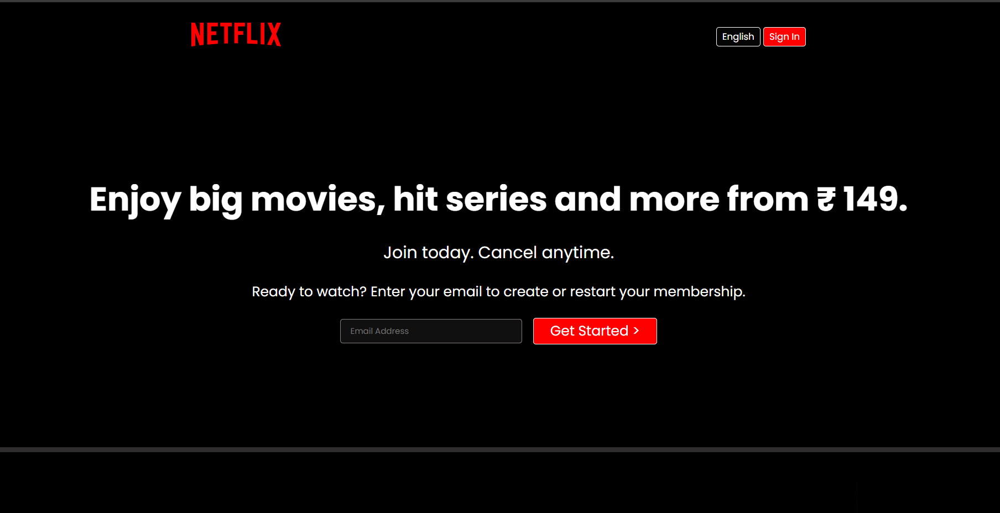

# 🎬 Netflix Clone

A fully responsive **Netflix landing page clone** built using **HTML5, CSS3, and JavaScript**.  
This project replicates the look and feel of the official Netflix India homepage with sleek UI design and responsive layouts.

---

## 🚀 Live Demo

🔗 [View Project on GitHub Pages](https://anamikaa1303.github.io/Netflix-clone-/)

---

## 🖼️ Project Preview



---

## 🧠 Features

- 🎥 **Responsive Design** — Fully optimized for all devices  
- 💡 **Hero Section** — Includes CTA with email input and membership message  
- 📱 **Download Feature** — Mobile layout with offline viewing visuals  
- 🌍 **Watch Everywhere** — Supports all device displays  
- 👨‍👩‍👧‍👦 **Kids Profiles** — Special section for kids  
- ❓ **FAQ Section** — Styled question layout  
- 🎨 **Pure HTML + CSS** — Clean, framework-free design  

---

## 🛠️ Technologies Used

| Technology | Purpose |
|-------------|----------|
| **HTML5** | Page structure |
| **CSS3** | Styling and responsive layout |
| **Google Fonts (Poppins, Martel Sans)** | Typography |
| **SVG / MP4 / PNG** | Images and media assets |

---


---

## ⚙️ How to Run Locally

1. **Clone the Repository**
   ```bash
   git clone https://github.com/Anamikaa1303/Netflix-clone-.git
   
2. Navigate to the Project Directory
   cd Netflix-clone-

3. Open in Browser
   start index.html

